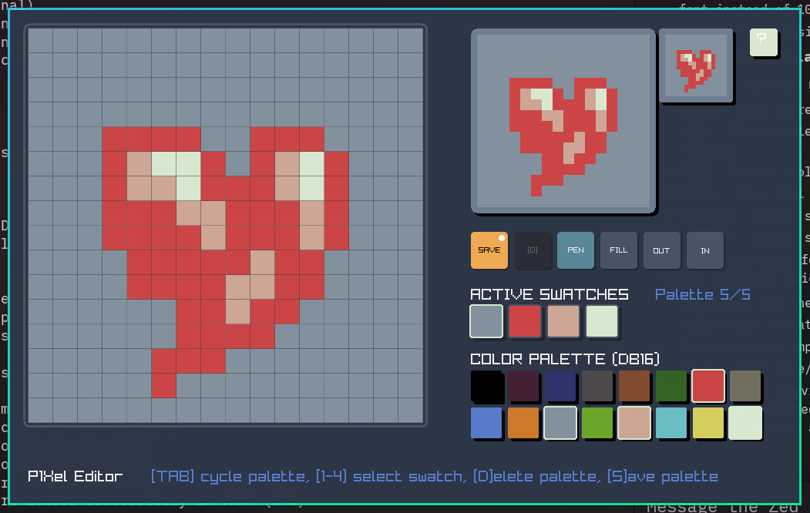
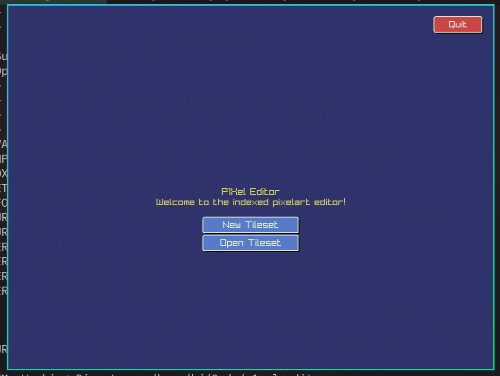

# P1Xel Editor

## About
Sprite editor for my MS-DOS game. Made in Zig and Raylib.

### Prototype


### Pre-alpha0


## Run
```
zig build run
```

## Build Small Binary

Host Linux -> Linux.
```
zig build \
  -Doptimize=ReleaseSmall \
  upx
```

Host Linux -> Windows
``` 
zig build \
  -Dtarget=x86_64-windows \
  -Doptimize=ReleaseSmall \
  upx
```
