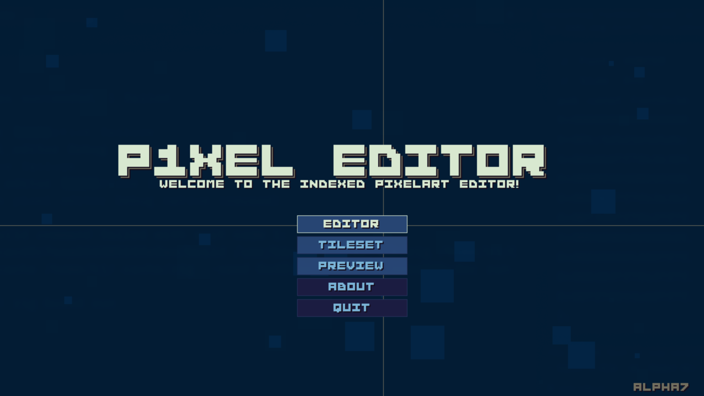
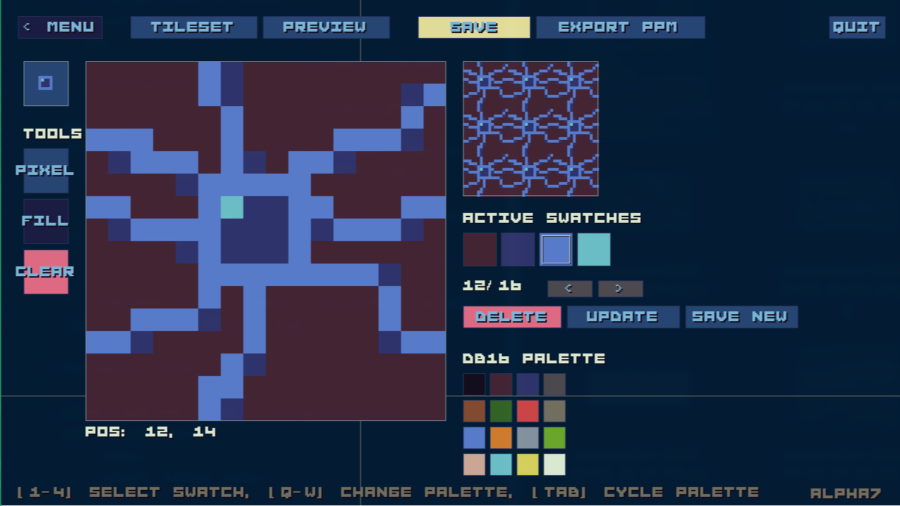
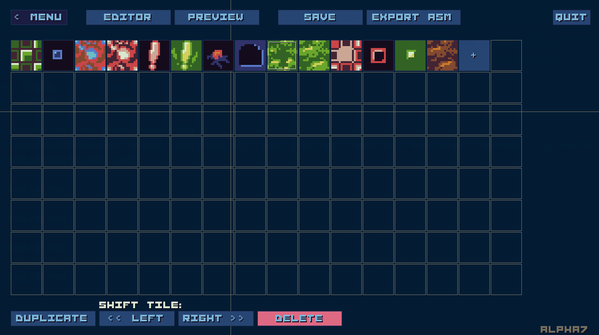
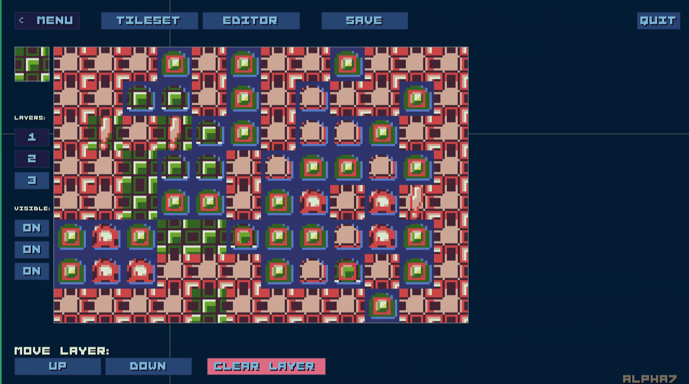

# P1Xel Editor



## About
Sprite editor for my MS-DOS game. Made in Zig and [fenster](https://github.com/zserge/fenster).



### Features

- Linux and Windows under 40KiB binary
- pixel perfect, 16x16 sprite/tile editor
- DawBringer's 16 color palette
- custom 4 color palette per tile
- 128 custom palettes
- organizing custom plalettes
- 128 tile per tileset
- save/load custom palettes
- save/load tileset
- organize tiles in tileset
- preview mode with 3 layers





## Run
```
zig build run
```

## Build Small Binary

Host Linux -> **Linux 64**
```
zig build \
  -Doptimize=ReleaseSmall \
  upx
```

Host Linux -> **Windows 32**
``` 
zig build \
  -Dtarget=x86-windows \
  -Doptimize=ReleaseSmall \
  upx
```
